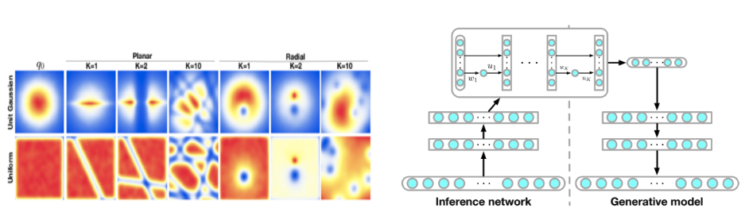

## Variational Inference with Normalizing Flows
[paper](https://arxiv.org/pdf/1505.05770) by Danilo Jimenez Rezende and Shakir Mohamed, from Google Deepmind

## Abstract
**Previous methods use simple posterior approximation which prevents high quality results**
> The choice of approximate posterior distribution is one of the core problems in variational inference. Most applications of variational inference employ simple families of posterior approximations in order to allow for efficient inference, focusing on mean-field or other simple structured approximations. This restriction has a significant impact on the quality of inferences made using variational methods. 

**We introduce more complex posterior approximations by applying normalizing flow**
> We introduce a new approach for specifying flexible, arbitrarily complex and scalable approximate posterior distributions. Our approximations are distributions constructed through a normalizing flow, whereby a simple initial density is transformed into a more complex one by applying a sequence of invertible transformations until a desired level of complexity is obtained. We use this view of normailizing flows to develop categories of finite and infinitesimal flows and provide a unified view of approaches for constructing rich posterior approximations. 

**This approach makes improvement in several experiment**
> We demonstrate that the theoretical advantages of having posteriors that better match the true posterior, combined with the scalability of amortized variational approaches, provides a clear improvement in performance and applicability of variational inference. 

## Method
The paper introduces new methods of normalizing flows, called `planer flows` and `radial flows`. These flows are used to transform a simple gaussian distribution to approximate posterior distribution in DLGM(Deep Latent Gaussian Models).

