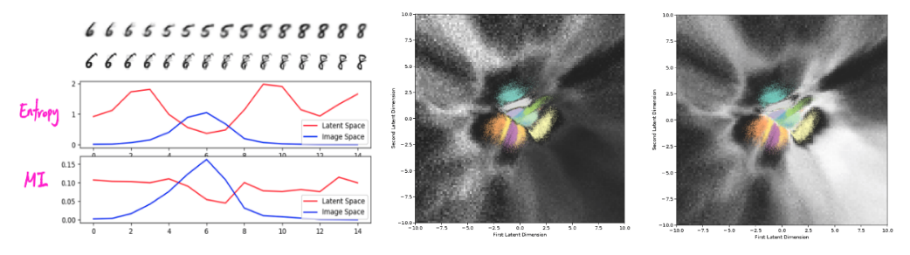

## Understanding Measures of Uncertainty for Adversarial Example Detection
[paper](https://arxiv.org/pdf/1803.08533.pdf) by Lewis Smith and Yarin Gal, from University of Oxford

## Abstract
**Mutual information is plausible to detect adversarial examples**
> Measuring uncertainty is a promising tequnique for detecting adversarial images, crafted inputs on which the model predicts on incorrect class with high confidence. But many measures of uncertainty exist, including predictive entropy and mutual information, each capturing different types of uncertainty. We study these measures, and shed light on why mutual information seems to be effective at the task of adversarial example detection. 

**Propose to overcome the failure of dropout method for estimating uncertainty by ensemble**
> We highlight failure modes for MC dropout, a widely used approach for estimating uncertainty in deep models. This leads to an improved understanding of the drawbacks of current method, and a proposal to improve the quality of uncertainty estimates using probabilistic model ensembles. 

**Several experiments**
> We give illustrative experiments using MNIST to demonstrate the intuition underlying the different measures of uncertainty, as well as experiments on a real world Kaggle dogs vs cats classification dataset. 

## Result
Mutual information (MI) between model parameters and class label.  
The possible hypothis is that adversarial examples lie off the manifold. Image generated from the interpolation on latent vector is thought to be on-manifold with aleotoric uncertainty, whereas interpolated image in image space is considered off-manifold (first figure).  
Second and third figure shows the MI and predictive entropy, respectively. MI is low between the classes, but predictive entropy is high.  

## Personal Review
- Is the hypothesis plausible?
- What if we can make adversarial images that cannot be detected by mutual information? (Does it exist? How can we make it?) Does this mean we can make adversarial images that is considered aleotoric uncertainty? 
