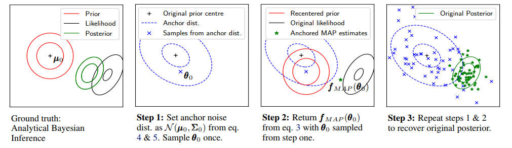
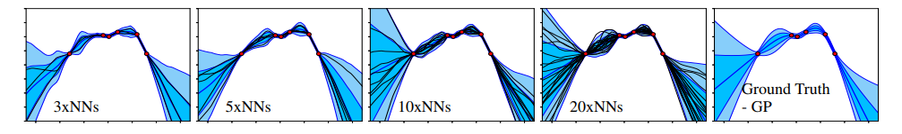

## Uncertainty in Neural Networks: Bayesian Ensembling
[paper](https://arxiv.org/pdf/1810.05546.pdf) by Tim Pearce, et.al., from University of Cambridge.

## Abstract
**Two major methods for measuring uncertainty which are Bayesian and ensemble, and there drawbacks** 
> Understanding the uncertainty of a neural network's (NN) prediction is essential for many applications. The Bayesian framework provides a principled approach to this, however applying it to NNs is challenging due to the large number of parameters and data. Ensembling NNs provides and easily implementable, scalable methods for uncertainty quantification, however, it has been criticized for not being Bayesian. 

**Propose ensemble that could be interpreted in Bayesian perspective: *randomised anchored MAP sampling***
> In this work we propose one modification to the usual ensembling process that does result in Bayesian behaviour: regularizing parameters about values drawn from prior distribution. We provide theoretical support for this procedure as well as empirical evaluation on regression, image classification, and reinforcement learning problems.  

## Method
The author brings the idea from *randomised MAP sampling*. Consider the Baye's rule, poserior is proportionate to the likelihood times the prior. In *randomised MAP sampling*, the prior mean is considered a random variable, and by calculating MAP from sampled prior mean, the distribution of MAP produces the true posterior. The distribution of the prior mean is called *anchor noise distribution*. This method can be seen as the minimisation of MAP parameters estimates with priors (regularizaiton term) centered at non-zero values.

As a result, It closely approximated ground truth as more NNs are sampled.

## Discussion
- Interesting to find to relation between ensembling and Bayesian. Theoretical support of ensemble makes us to use ensemble in real world for evaluating uncetainty.  
- When applied to NNs, the proof of approximating covariance term (appendix B) seems week.
- Does *randomised MAP sampling* also plausible in non-Gaussian framework?
